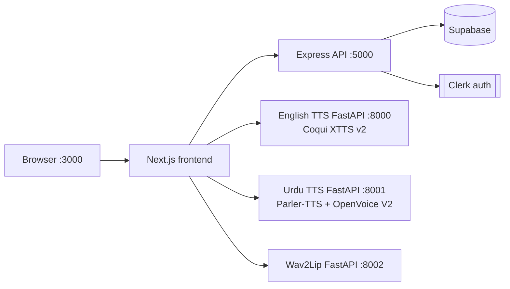

# Project handoff — architecture, D-drive setup, migration

**Last updated:** 2026-03-25  
**Repo root (this machine):** `D:\FYP_3\FYP-Content-Creation-Lip-sync-Voice-cloning`

This file is the **single onboarding document** for future chats and teammates. Update it when ports, paths, or services change.

---

## 1. Can you move the Urdu / English TTS environments from another laptop?

**Sometimes, but do not rely on copying a `venv` folder.**

| Approach | Will it work? |
|----------|----------------|
| **Copy only the repo + recreate venvs** | **Recommended.** Same Python major/minor (e.g. 3.11), install from `requirements.txt`, reuse `D:\DevCaches\...` for HF/torch caches. |
| **Copy the whole `english_tts_env` / `urdu_tts_env` tree** | **Fragile.** Virtualenvs record the **absolute path** to the Python interpreter in `pyvenv.cfg` and in launcher scripts. If the new PC has a different path or Python version, imports break. |
| **Copy model caches** | **Yes, if you copy the same directories** you point `HF_HOME`, `TRANSFORMERS_CACHE`, `TORCH_HOME`, `TTS_HOME` at (see §5). Saves re-downloading GBs. |
| **Different GPU / CUDA** | Reinstall **matching** `torch`/`torchaudio` wheels for that machine. Symptom of mismatch: `cublas64_*.dll` errors or CUDA OOM. |

**Practical recipe after moving disks or cloning the folder:**

1. Install Python (prefer **same version** as the old laptop; project docs mention 3.10+; this tree may use **nested** venvs: `english_tts_env\english_tts_env`, `urdu_tts_env\urdu_tts_env`).
2. Recreate venvs **under this repo on `D:`** and `pip install -r ...` for English and Urdu.
3. Copy **checkpoints** into `checkpoints_v2\converter\` (OpenVoice) and ensure Wav2Lip checkpoint path/env vars match `Wav2Lip_Service`.
4. Start services and hit each **`/health`** endpoint (§4).

---

## 2. High-level architecture

| Port | Service | Tech | Main folder |
|------|---------|------|-------------|
| 3000 | Frontend | Next.js | Repo root (`pnpm dev`) |
| 5000 | Backend | Express + Clerk + Supabase | `server/` (`pnpm dev`) |
| 8000 | English TTS | FastAPI, **Coqui XTTS v2** voice clone | `English_TTS/englishttts/` |
| 8001 | Urdu TTS | FastAPI, **Indic Parler-TTS** + **OpenVoice V2** | `Urdu_TTS/` |
| 8002 | Lip-sync | FastAPI, shells **Wav2Lip** (`inference.py`) | `Wav2Lip_Service/` |

### Request flow (conceptual)

1. **Auth:** Clerk protects non-public routes (`middleware.ts`).
2. **Media / jobs:** The Node server owns **Supabase** rows (e.g. `tts_jobs`, `user_media`) and resolves **file paths** on disk for the logged-in user (`server/src/controllers/ttsController.ts`).
3. **TTS:** Next.js API routes (when present) or the UI call the **Python microservices** with **absolute paths** to reference WAVs and output locations. English: `POST /tts/clone`. Urdu: `POST /tts/urdu`.
4. **Lip-sync:** Wav2Lip service accepts paths / job info, runs subprocess against cloned repo + checkpoint; outputs land under paths consumed by Node (`LIPSYNC_Output/...` per `lipsyncController.ts`).

---

## 3. Important paths inside the repo

| Path | Purpose |
|------|--------|
| `English_TTS/englishttts/fastapi_server.py` | English FastAPI; writes defaults under `TTS_Output/results` |
| `Urdu_TTS/fastapi_server.py` | Urdu FastAPI; writes under `TTS_Output/urdu`, profiles under `TTS_Output/urdu_profiles` |
| `checkpoints_v2/converter/` | **OpenVoice** — must contain `checkpoint.pth`, `config.json` |
| `TTS_Output/` | Generated audio + urdu profiles (often gitignored) |
| `Wav2Lip_Service/fastapi_server.py` | Lip-sync; defaults: repo `D:\DevCaches\wav2lip-src`, weights `D:\DevCaches\wav2lip-checkpoints\wav2lip_gan.pth` |
| `server/src/index.ts` | Mounts `/api/tts`, `/api/lipsync`, etc. |

### Workspace note (this copy on D:)

The full **`app/`** + **`components/`** tree is synced from the upstream GitHub repo (see changelog). **`pnpm dev`** uses **`--webpack`** for stability with Tailwind/PostCSS.

---

## 4. How to run everything locally

### Environment variables

- **Frontend:** `.env.local` — Clerk keys, `NEXT_PUBLIC_API_URL`, `PYTHON_TTS_URL` (English), `URDU_TTS_URL`, `INTERNAL_API_SECRET`, etc. Templates described in `ENV_SETUP.md`, `TEAMMATE_SETUP_GUIDE.md`.
- **Backend:** `server/.env` — Clerk secret, Supabase, same internal secret, `FRONTEND_URL`, ports.

### Start order (typical)

1. **English TTS:** `English_TTS\englishttts\run_server.bat` → `http://127.0.0.1:8000/health`
2. **Urdu TTS:** `Urdu_TTS\run_server.bat` → `http://localhost:8001/health`
3. **Wav2Lip (optional):** `Wav2Lip_Service\run_server_clean2.bat` → `http://127.0.0.1:8002/health`
4. **Node:** `cd server` → `pnpm dev` (or `npm run dev`) → `http://localhost:5000/test`
5. **Next:** repo root → `pnpm dev` → `http://localhost:3000`

### Health checks

- English: `GET http://localhost:8000/health`
- Urdu: `GET http://localhost:8001/health`
- Wav2Lip: `GET http://localhost:8002/health` (if enabled)
- Backend: `GET http://localhost:5000/test`

---

## 5. D-drive policy (“no C: usage”) — what is realistic

**Project scripts** set caches to:

- `D:\DevCaches\hf`, `D:\DevCaches\torch`, `D:\DevCaches\TTS_HOME`, `D:\DevCaches\temp` (where used)
- pnpm: prefer `--store-dir D:\DevCaches\pnpm-store` (see older notes)

**Windows cannot honestly promise “not a single byte on C:”** while using normal desktop tooling: the OS, Defender, `%LOCALAPPDATA%` for some tools, default `TEMP`, browser profiles, Windows Store Python, `py` launcher hooks, etc. may still touch `C:`. What we **do** control is: **repo, venvs, HuggingFace/torch caches, pnpm store, and Wav2Lip clone/checkpoints** directed at **`D:\FYP_3\...`** and **`D:\DevCaches\...`**. Document any new tool’s cache path here if you add one.

---

## 6. Elsewhere in the docs (do not duplicate everything here)

| File | Contents |
|------|----------|
| `README.md` | Product overview, Clerk, structure **(may not match this disk copy)** |
| `TEAMMATE_SETUP_GUIDE.md` | Full stack, SQL snippets, TTS setup commands |
| `ENV_SETUP.md` | `.env.local` / `server/.env` examples |
| `fastapi.md` | Legacy **E:\** path examples for English TTS — **ignore drive letters**; follow this `progress.md` + `run_server.bat` |
| `SETUP_INSTRUCTIONS.md` | Older Firebase/ElevenLabs narrative; **current stack is Clerk + Supabase + local Python TTS** per teammate guide |

---

## 7. Known fixes applied in this codebase (historical)

- **Urdu:** `run_server.bat` was **deduplicated** (two full copies in one file); uses `..\checkpoints_v2\converter` and D-cache env vars.
- **Urdu:** `fastapi_server.py` default `OPENVOICE_CONVERTER_DIR` is now **repo-relative** (`checkpoints_v2/converter`), not `F:\...`.
- **Urdu:** Prior CUDA/`cublas` issues sometimes require `URDU_DEVICE=cpu` in `run_server.bat` or a CPU fallback in OpenVoice/Whisper extraction (see git/history if reverted).
- **English:** Coqui XTTS may need `torch.load(..., weights_only=False)` compatibility patch in Coqui’s `TTS/utils/io.py` on newer PyTorch.
- **Wav2Lip:** Entry script in repo is **`Wav2Lip_Service\run_server_clean2.bat`** (not `run_server.bat`).

---

## 8. Changelog (append new entries at the top)

- **2026-03-25:** Urdu Stage 2 OpenVoice: patched `site-packages/openvoice/se_extractor.py` to fall back **CPU int8** for `faster_whisper` when CUDA hits `cublas64_12.dll` / cuBLAS load errors (PyTorch cu118 vs whisper cu12). `run_server.bat` sets `OPENVOICE_WHISPER_DEVICE=cpu` to skip a failed GPU attempt on each request.
- **2026-03-25:** Restored full frontend from `https://github.com/fahamin5149/FYP-Content-Creation-Lip-sync-Voice-cloning` by replacing local `app/`, `components/`, and `middleware.ts` (and `components.json`) from upstream; **stub `app/` removed**. `package.json` **`dev`** remains **`next dev --webpack`** to avoid Turbopack/PostCSS panics on Tailwind.
- **2026-03-25:** **Moved Python venv repair:** English + Urdu venvs pointed at old machines (`C:\Python311`, Windows Store Python on `HP` user, `F:\...`). Upgraded both with `D:\DevCaches\Python311-full\python.exe -m venv --upgrade <venv_path>` so `Scripts\python.exe` works on this PC. Installed **full** Python 3.11.9 to `D:\DevCaches\Python311-full` (the existing `D:\DevCaches\Python311` embeddable build has **no `venv` module** — do not use it for `--upgrade`). English TTS verified: `GET http://127.0.0.1:8000/health` → `model_loaded: true` (CPU torch in this venv). Helper: `English_TTS/englishttts/start_english_tts_background.ps1` + `_run_uvicorn.py` + logs `english_tts_server*.log`. Urdu venv imports OK (`torch 2.7.1+cu118`); start with `Urdu_TTS/run_server.bat` when ready.
- **2026-03-25:** Node on D: was only `node.exe` (no npm/pnpm). Replaced with full **Node 20.20.0** zip under `D:\DevCaches\node\node-v20.20.0-win-x64`, enabled **corepack + pnpm@9.15.4**. Added repo + `server/.npmrc` with `store-dir=D:/DevCaches/pnpm-store`. Removed invalid `eslint` key from `next.config.mjs`. Added minimal `app/` stub; `server/tsconfig.json` sets `declaration: false` so `pnpm run build` succeeds under pnpm (fixes TS2742 on Express routers).
- **2026-03-25:** Rewrote this handoff; fixed duplicate `Urdu_TTS/run_server.bat`; repo-relative OpenVoice default in `Urdu_TTS/fastapi_server.py`; noted missing `app/` in this workspace copy.
